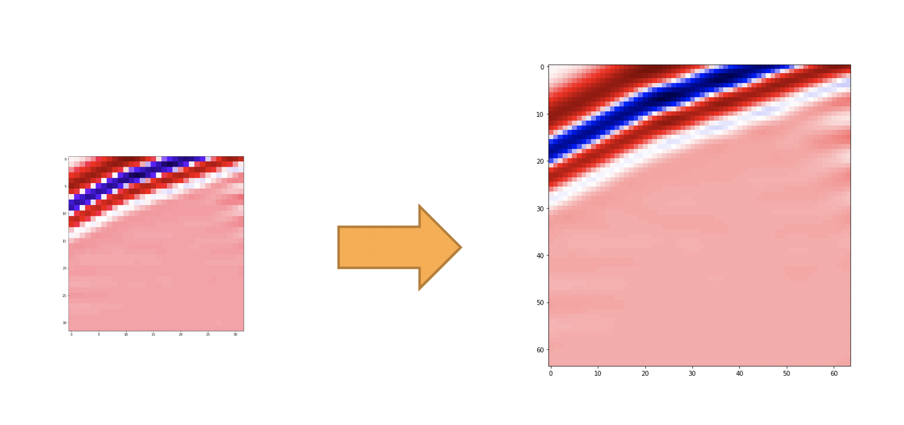

# super-resolution

Este projeto visa o desenvolvimento de um sistema de apoio à experimentação da super resolução de dados sísmicos. 



## Organização

`_data/`: Arquivos estáticos, como log, dataset e pesos dos modelos

`dataset/`: Módulo responsavel pelo tratamento e carregamento do dataset

`docs/`: Arquivos de documentação

`ipynb/`: Sandbox com os Jupyter notebooks utilizados durante o desenvolvimento do projeto. 
Alguns destes notebooks podem estar descontinuados devido ao desenvovlimento e alterações dos moódulos deste projeto

`models/`: Desenvolvimento das redes neurais e os demais modelos de super resolução

`super_resolution/`: Módulo principal do projeto, contendo as função com o pipeline de experimentação. 

`tasks/`: Funções baseadas na biblioteca [invoke](http://www.pyinvoke.org/) para serem rodadas por linha de comando

`tests/`: Testes unitários

`utils/`: Funções auxiliares   

## Documentação

a [documentação](docs/README.md) deste projeto apresenta os dados necessarios e os módulos `dataset`, `models`, 
`super_resolution`, `tests` e `utils`.

## Desenvolvimento

Este projeto e desenvolvido utilizando `python 3.7.4`. É recomendado usar o [pyenv](https://github.com/pyenv/pyenv)
como gerenciador de versão python. Ele pode ser facilmente instalado com [pyenv installer](https://github.com/pyenv/pyenv-installer).

### Clone

Para clonar este repositorio, execute o seguinte comando:

```
git clone https://github.com/Pedalves/super-resolution.git
```

- via ssh(**recomendado**):
```
git clone git@github.com:Pedalves/super-resolution.git
```

Observe que você deve ter uma chave SSH com acesso ao repositório do projeto.

### Build

Pipenv é a ferramenta de gerenciamento de pacotes Python oficialmente recomendada. 
Instale o `pipenv` conforme descrito em seu [repositoria oficial](https://github.com/pypa/pipenv#installation) and execute the following command.

```
pipenv install
``` 

## Invoke

Este projeto conta com o uso da biblioteca [invoke](http://www.pyinvoke.org/), uma ferramente de execução de tarefas, 
para disponibilizar o uso do projeto por linha de comando.
As principais tarefas implementadas e seus usos se encontra descritos a baixo: 


### Baseline

Executa a função de avaliação do baseline

```
pipenv shell
invoke baseline.evaluate -d DATASET_PATH
```
ou
```
pipenv run invoke baseline.evaluate -d DATASET_PATH
```

* dataset_path: Caminho para a pasta contendo o dataset. O valor default é ``_data/dataset/artificial``


### MLP

Executa as funções de avaliação e treino do MLP

```
pipenv shell
invoke mlp.train -e EPOCHS -d DATASET_PATH -s SAVE_PATH
```
ou
```
pipenv run invoke mlp.train -e EPOCHS -d DATASET_PATH -s SAVE_PATH
```

* **epochs**: Número de épocas de treinamento do modelo.
* dataset_path: Caminho para a pasta contendo o dataset. O valor default é ``_data/dataset/artificial/``.
* save_path: Caminho para a pasta de armazenamento dos pesos. O valor default é ``_data/weights/``.
* **kwargs: Conferir em [MLP](docs/models.md)

```
pipenv shell
invoke mlp.evaluate -l LOAD_PATH -d DATASET_PATH
```
ou
```
pipenv run invoke mlp.evaluate -l LOAD_PATH -d DATASET_PATH
```

* **load_path**: Caminho para o arquivo dos pesos a serem carregados.
* dataset_path: Caminho para a pasta contendo o dataset. O valor default é ``_data/dataset/artificial/``.
* **kwargs: Conferir em [MLP](docs/models.md)

### Residual Dense Network

Executa as funções de avaliação e treino do Residual Dense Network

```
pipenv shell
invoke rdn.train -e EPOCHS -d DATASET_PATH -s SAVE_PATH
```
ou
```
pipenv run invoke rdn.train -e EPOCHS -d DATASET_PATH -s SAVE_PATH
```

* **epochs**: Número de épocas de treinamento do modelo.
* dataset_path: Caminho para a pasta contendo o dataset. O valor default é ``_data/dataset/artificial``.
* save_path: Caminho para a pasta de armazenamento dos pesos. O valor default é ``_data/weights/``.
* **kwargs: Conferir em [Residual Dense Network](docs/models.md)

```
pipenv shell
invoke rdn.evaluate -l LOAD_PATH -d DATASET_PATH
```
ou
```
pipenv run invoke rdn.evaluate -l LOAD_PATH -d DATASET_PATH
```

* **load_path**: Caminho para o arquivo dos pesos a serem carregados.
* dataset_path: Caminho para a pasta contendo o dataset. O valor default é ``_data/dataset/artificial/``.
* **kwargs: Conferir em [Residual Dense Network](docs/models.md)

### Testes

Executa os testes unitários

```
pipenv shell
invoke tests -p PATH -e EXPRESSION (--log)
```
ou
```
pipenv run invoke tests -p PATH -e EXPRESSION (--log)
```

* path: Caminho para a pasta raiz contendo os testes a serem realizados.
* expression: String contendo a substring presente no nome dos testes a serem realizados.
* log: Indica se o log sera salvo no arquivo `_data/log/test.log`