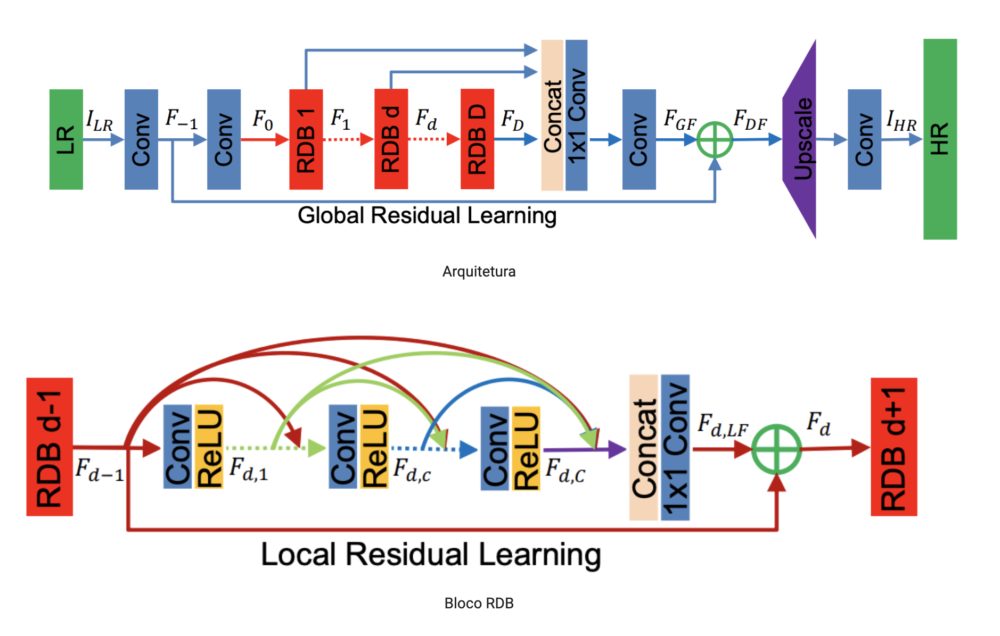

# Modelos

Este módulo contem a classe referente ao baseline, assim como os modelos e camadas de redes neurais
desenvolvidos.

## Baseline

O baseline consiste em uma interpolação bi-cúbica implementada através do OpenCV.

### Execução
``` python
from models.baseline import Baseline

baseline = Baseline(scale)

y_b = baseline.predict(x)
report_df = baseline.evaluate(x, y)
```

* __init\__: Construtor da classe.
    * scale: O fator de aumento da resolução. O valor default é ``2``.

* predic: Aumenta a resolução de um array.
    * **x**: Array de entrada.
    
* evaluate: Avalia o MSE e o PSNR da predição.
    * **x**: Array de entrada.
    * **y**: Ground truth.

## Redes Neurais

Os modelos de redes neurais implementados neste módulo herdam necessariamente da classe `NeuralNetwork`, 
que por sua vez herda de `tf.keras.Model`.

*  __init\__: Construtor da classe.
    * **base_name**: Nome da rede.
    * **init_shape**: Dimensão de entrada dos dados.
    * learning_rate: Taxa de aprendizagem da rede. O valor default é ``0.001``
    * loss: Função de perda da rede, podendo ser `mse` ou `mae`. O valor default é ``mae``
    * **kwargs: kwargs
    
* get_architecture_str: Retorna a string referente a arquitetura da rede. **Necessita ser implementada pelas sub classes**.

* get_name: Retorna o nome do modelo, que é construido através da junção do nome da rede, a string referente a arquitetura 
e o número de épocas treinadas.

* call: Função call do tensorflow. Responsável pela definição do fluxo da entrada `x` pela rede.
**Necessita ser implementada pelas sub classes**.
    * **x**: Entrada do modelo.

* train: Função de calculo do gradiente e atualização dos pesos da rede.
    * **x**: Entrada do modelo.
    * **y**: Ground truth.

* save_weights: Salva os pesos da rede no formato h5.
    * save_path: Caminho para a pasta de armazenamento dos pesos. O valor default é ``_data/weights/``.

* load_weights: Carrega os pesos provenientes de um arquivo h5.
    * **weights**: Caminho para o arquivo dos pesos a serem carregados.

* create_model: Executa o build do modelo.

* get_tensor_dataset: Converte um array numpy em um tensor slice.
    * **x**: Entrada do treino.
    * **y**: Ground truth do treino.
    * **x_val**: Entrada da validação.
    * **y_val**: Ground truth da validação.

* train_epochs: Treina o modelo por um valor definido de épocas.
    * **x**: Entrada do treino.
    * **y**: Ground truth do treino.
    * **x_val**: Entrada da validação.
    * **y_val**: Ground truth da validação.
    * **n_epochs**: Número de épocas.
    * **batch_size**: Tamanho do batch de treinamento.
    * verbose: Define a verbosidade. O valor default é ``True``.
    * frequency: Frequência em épocas do número de prints. O valor default é ``5``.

### MLP

Implementação de uma rede Multi Layer Perceptron.

#### Execução
``` python
from models.neural_networks import MLP

model = MLP(init_shape, layers_dims, original_dim, learning_rate, activ_hidden, activ_out, loss, **kwargs)

result = model.train_epochs(x_train, y_train, x_val, y_val, n_epochs, batch_size)

y = model(x_val)
mlp_mse = mse(y_val, y)
mlp_psnr = psnr(y_val, y)
```

*  __init\__: Construtor da classe.
    * **init_shape**: Dimensão de entrada dos dados.
    * layer_dims: Lista contendo o número de neuronios por camada escondida. O valor default é ``[512]``.
    * original_dim: Dimensão da imagem após o aumento de resoluçao. O valor default é ``64``.
    * learning_rate: Taxa de aprendizagem da rede. O valor default é ``0.0001``
    * activ_hidden: Função de ativação das camadas escondidas. O valor default é ``tf.nn.tanh``
    * activ_out: Função de ativação da camada final. O valor default é ``tf.nn.tanh``
    * loss: Função de perda da rede, podendo ser `mse` ou `mae`. O valor default é ``mae``
    * **kwargs: kwargs
    

### Residual Dense Network

Implementação do modelo baseado no artigo [Residual Dense Network for Image Super-Resolution](https://arxiv.org/pdf/1802.08797.pdf)



#### Execução
``` python
from models.neural_networks import ResidualDenseNetwork

model = ResidualDenseNetwork(init_shape, filters, original_dim, rdb_blocks, rdb_block_size, learning_rate, 
                             activ_hidden, activ_out, loss, **kwargs)

result = model.train_epochs(x_train, y_train, x_val, y_val, n_epochs, batch_size)

y = model(x_val)
rdn_mse = mse(y_val, y)
rdn_psnr = psnr(y_val, y)
```
*  __init\__: Construtor da classe.
    * **init_shape**: Dimensão de entrada dos dados.
    * filters: Número de filtros das camadas convolutivas. O valor default é ``64``.
    * original_dim: Dimensão da imagem após o aumento de resoluçao. O valor default é ``64``.
    * rdb_blocks: Número de blocos RDB. O valor default é ``3``.
    * rdb_block_size: Número de redes convolutivas dos blocos RDB. O valor default é ``3``.
    * learning_rate: Taxa de aprendizagem da rede. O valor default é ``0.0001``
    * activ_hidden: Função de ativação das camadas escondidas. O valor default é ``tf.nn.relu``
    * activ_out: Função de ativação da camada final. O valor default é ``tf.nn.tanh``
    * loss: Função de perda da rede, podendo ser `mse` ou `mae`. O valor default é ``mae``
    * **kwargs: kwargs
